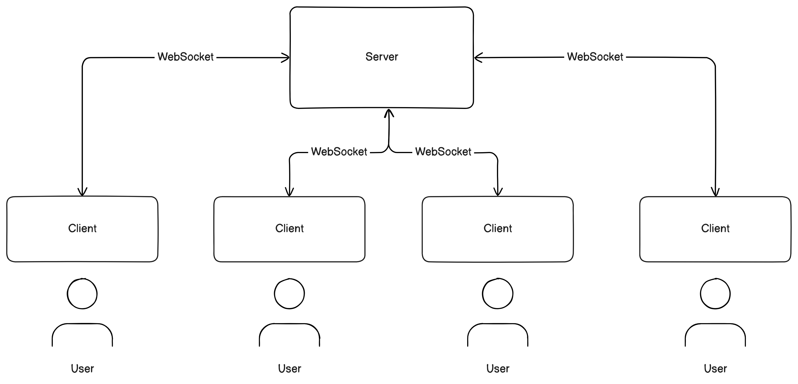

# Chat Server & Chat Client

Das Projekt ermöglicht die Kommunikation zwischen mehreren Clients über einen zentralen Server.
Der Server übernimmt dabei die Aufgabe, alle verbundenen Clients zu verwalten und die eingehenden Nachrichten an die entsprechenden Empfänger weiterzuleiten.
Die Clients sind über WebSockets mit dem Server verbunden, was eine bidirektionale und kontinuierliche Verbindung ermöglicht.
Dadurch können Nachrichten in Echtzeit ausgetauscht werden, ohne dass die Clients ständig neue Anfragen an den Server stellen müssen.



Das Projekt wurde in Typescript (Node.js) und in Go implementiert.
Die Typescript Implementierung befindet sich im Ordner `Typescript` und die Go Implementierung befindet sich im Ordner `Go`.

## Typescript (Node.js) Implementierung

In TypeScript wurden sowohl der Server als auch der Client implementiert.
Die Kommunikation zwischen den Clients laufen über den Server.

Zusätzlich wurde die Funktionalität integriert, neue Chat Rooms zu erstellen und ihnen beizutreten. Dadurch können die Clients über denselben Server in verschiedenen Chat Rooms miteinander kommunizieren. Der Server übernimmt hierbei die Weiterleitung der Nachrichten an die jeweils zugehörigen Clients.

### Sequenz Diagramm

Beim Start verbinden sich die Clients automatisch mit dem Server und senden ihren jeweiligen Benutzernamen. Jeder Client hat die Möglichkeit, entweder einen neuen Raum zu erstellen oder einem bestehenden Raum beizutreten.

Entscheidet sich ein Client, einen neuen Raum zu hosten, erhält er vom Server einen eindeutigen Raumschlüssel. Dieser Schlüssel kann an andere Clients weitergegeben werden, sodass diese dem gehosteten Raum beitreten können.

Sobald ein Client eine Nachricht in einem Raum sendet, übernimmt der Server die Weiterleitung der Nachricht an alle anderen Clients, die sich ebenfalls in diesem Raum befinden. Auf diese Weise wird die Kommunikation innerhalb der Räume organisiert und gewährleistet, dass Nachrichten nur an die entsprechenden Teilnehmer weitergeleitet werden.


### Aufsetzen des Projekts

1. **Node.js**: Stelle sicher, dass Node.js installiert ist

   [Falls nicht kannst du hier Node.js herunterladen](https://nodejs.org/).

2. **pnpm**: Installiere pnpm über npm. (npm ist standardmäßig in Node.js enthalten)

   Führe dafür folgenden Code in deinem Terminal aus.

   ```
   npm install -g pnpm
   ```

   Prüfe die Installation mit:

   ```
   pnpm -v
   ```

   Weitere Informationen zu pnpm findest du [hier](https://pnpm.io/).

3. **Installation**: Installiere jetzt alle Abhängigkeiten des Projektes

   Führe dafür in deinem Terminal folgendes aus:

   ```
   cd Typescript/server
   ```

   dann

   ```
   pnpm install
   ```

   Das gleiche auch für den Client:

   ```
   cd ../client
   ```

   dann

   ```
   pnpm install
   ```

### Start des Projektes

Du kannst den Server und den Client Starten indem du sie im Terminal öffnest und jeweils folgenden Befehl ausführst:

```
pnpm start
```

Wichtig ist, dass du immer ein neues Terminal pro laufenden Client/Server öffnen musst.
(Bitte nicht mehrere Server gleichzeitig starten.)

### Start der Tests

Du kannst die Tests für den Server starten indem du den Server im Terminal öffnest und folgenden Befehl ausführst:

```
pnpm test
```

## Go Implementierung

In Go wurden sowohl der Server als auch der Client implementiert.
Die Kommunikation zwischen den Clients laufen über den Server.

### Sequenz Diagramm

Beim Start verbinden sich die Clients automatisch mit dem Server und senden ihren jeweiligen Benutzernamen. Diese Nachrichten werden vom Server an alle verbundenen Clients weitergeleitet.


### Aufsetzen des Projektes

1. **_Go_**: Stelle sicher das Go installiert ist

   [Falls nicht kannst du dir hier die Go herunterladen](https://go.dev/dl/)

   Prüfe die Installation mit:

   ```
   go version
   ```

### Start des Projektes

Starte den Server indem du ihn im Terminal öffnest und folgenden Befehl ausführst:

```
go run server.go
```

Starte den Client indem du ihn im Terminal öffnest und folgenden Befehl ausführst:

```
go run client.go
```
